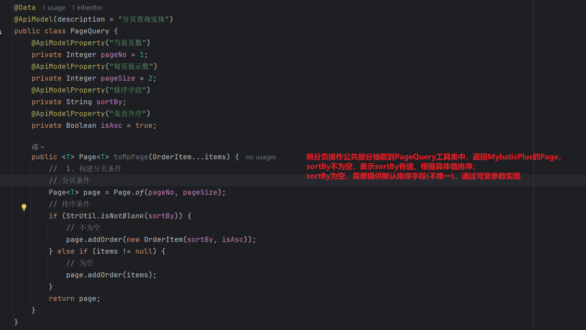

## 一、SpringCloud微服务

### 1、介绍


### 2、技术


## 二、MybatisPlus

### 1、介绍


### 2、快速入门

#### 2.1、入门案例

--学会MP的基本用法、体会MP的无侵入和方便快捷的特点


```xml
<!-- https://mvnrepository.com/artifact/com.baomidou/mybatis-plus-boot-starter -->
<dependency>
    <groupId>com.baomidou</groupId>
    <artifactId>mybatis-plus-boot-starter</artifactId>
    <version>3.5.3.1</version>
</dependency>
```


===小结


#### 2.2、常见注解

##### 2.2.1、原理


===如果我不按照约定去定义字段名，那该怎么解决呢？

===使用注解

##### 2.2.2、常见注解


===注意：


- 如果成员变量是布尔类型且属性名是is开头，那么在反射阶段会将is去掉将后面的单词作为表的字段名，此时无法与表中的字段名对应。**isMarried**也需要通过注解来指定。
- 如果成员变量名是数据库表中的关键字，会产生歧义，因此 **order**也需要通过注解并转译来指定表中的字段名。
- 如果成员变量在数据库表中是不存在的字段，也需要通过注解的 exist = false来标识该变量名不是表中的字段。


===但是在yaml文件中配置了idType的值，就不用特意指定。

##### 2.2.3、小结


#### 2.3、常见配置


===小结


### 3、核心功能

#### 3.1、条件构造器

##### 3.1.1、介绍


##### 3.1.2、案例一


##### 3.1.3、案例二


===说明：案例一和案例二是硬编码，复用性较差。

##### 3.1.4、使用lambdaQueryWrapper

通过反射自动获取成员变量名，避免硬编码


##### 3.1.5、小结


#### 3.2、自定义SQL

##### 3.2.1、介绍


##### 3.2.2、案例一


（1）思路


（2）演示


===问题：为什么要使用自定义SQL？

===当where条件之前的部分，有不固定的数据，使用Wrapper无法直接完成这个SQL语句，此时就需要我们手动完成where之前的部分，在将where之后的条件查询交给Wrapper。


#### 3.3、Service接口

##### 3.3.1、种类


##### 3.3.2、思路


##### 3.3.3、演示


##### 3.3.4、小结


#### 3.4、案例-普通查询

##### 3.4.1、分析


===一般dto是用来接受前端json的，vo是返回给前端的


##### 3.4.2、演示

（1）新增用户


（2）删除用户


（3）根据id查询用户


（4）根据id批量查询


（5）修改用户


===总结

​		如果在controller层使用IService中的方法就能完成业务逻辑，就不需要自定义service中的方法；

​		如果在controller层、service层都不能完整实现具体业务，就需要自定义mapper层方法去操作。

### ---扩展：Swagger

（1）@Api注解的作用 --- 标记整个controller类的描述信息

（2）@ApiOperation的作用 --- 标记单个接口方法的描述信息

（3）为什么需要使用这些注解？

- **自动化文档生成** 无需手动编写文档，代码变更后文档自动同步更新，减少维护成本。

- **提升开发效率** 前端/客户端开发者通过 Swagger UI 即可查看接口细节，无需频繁沟通。

- **交互式测试支持** 直接在 Swagger UI 中调试接口（输入参数、查看响应）。

- **标准化 API 描述** 统一团队文档规范，避免描述混乱。

- **与 OpenAPI 规范集成** 生成的文档符合 OpenAPI 标准，可被其他工具（如 Postman）导入使用。

（4）对比总结

| 注解            | 作用范围      | 主要用途                                      |
| --------------- | ------------- | --------------------------------------------- |
| `@Api`          | Controller 类 | 分组接口、描述整体功能模块                    |
| `@ApiOperation` | 接口方法      | 描述单个接口的细节和业务逻辑                  |
| @ApiParam       | 形参          | 如果参数是路径参数，或者是集合/数据时进行标识 |


#### 3.5、案例-IService的lambda查询

##### 3.5.1、分析


##### 3.5.2、演示


#### 3.6、案例-Iservice的lambda更新

##### 3.6.1、分析


##### 3.6.2、演示


===优化


#### 3.7、案例-批量添加用户

##### 3.7.1、分析


##### 3.7.2、演示-不使用批处理


##### 3.7.3、演示-使用批处理


##### 3.7.4、优化方案-使用MySQL参数


===使用像这样的SQL语句，那么批处理只需执行一次SQL语句，效率提高了。


##### 3.7.5、小结


### 4、扩展功能

#### 4.1、代码生成


#### 4.2、静态工具

##### 4.2.1、分析


##### 4.2.2、演示-需求一


===总结：

​		在MP最新版本中，可以使用该静态工具来解决service之间相互依赖的问题，提高开发效率，降低耦合；

​		在MP老版本中，没有该静态工具，如果service之间需要相互依赖，还是得要注入依赖，要尽可能使用mapper来解决，避免循环依赖。

##### 4.2.3、演示-需求二


```java
@Override
public List<UserVO> getUserAndAddressesByIds(List<Long> ids) {
    // 1. 查询用户
    List<User> users = listByIds(ids);
    if (CollUtil.isEmpty(users)) {
        throw new RuntimeException("抱歉，用户信息为空");
    }
    // 2. 查询地址
    // 3. 获取用户id集合
    List<Long> userIds = users.stream().map(User::getId).toList();
    // 4. 根据id获取用户地址集合
    List<Address> addressList = Db.lambdaQuery(Address.class).in(Address::getUserId, userIds).list();
    // 8. 地址转VO
    List<AddressVO> addressVOS = BeanUtil.copyToList(addressList, AddressVO.class);
    // 9. 对地址值分组，相同用户为一组
    Map<Long, List<AddressVO>> addressMap = new HashMap<>(0);
    if (CollUtil.isNotEmpty(addressVOS)) {
        addressMap = addressVOS.stream().collect(Collectors.groupingBy(AddressVO::getUserId));
    }


    // 5. 转VO
    ArrayList<UserVO> list = new ArrayList<>(users.size());
    for (User user : users) {
        // 6. UserPO转VO
        UserVO vo = BeanUtil.copyProperties(user, UserVO.class);
        // 10. 存入集合
        list.add(vo);
        // 7. 地址转VO
        vo.setAddresses(addressMap.get(user.getId()));
    }
    return list;
}
```


##### 4.2.4、演示-需求三


#### 4.3、逻辑删除

##### 4.3.1、介绍


##### 4.3.2、分析


##### 4.3.3、演示


##### 4.3.4、小结


#### 4.4、枚举处理器

##### 4.4.1、分析


##### 4.4.2、步骤


##### 4.4.3、演示


===补充：同时也不要忘了VO中的status属性，不然PO转VO的话，VO接收不了枚举类型的PO-status。


===如何实现想要显示的结果的状态为正常/冻结？


##### 4.4.4、小结


#### 4.5、JSON处理器

##### 4.5.1、分析


##### 4.5.2、演示


### 5、插件功能

#### 5.1、介绍


#### 5.2、分页插件

##### 5.2.1、步骤


##### 5.2.2、演示


#### 5.3、通用分页实体

##### 5.3.1、案例


##### 5.3.2、演示


===说明：其它的实体类也有可能需要分页，所以创建一个公共分页类，让所有实体类都继承该类。


===UserServiceImpl

```java
@Override
public PageDTO<UserVO> queryUserPages(UserQuery query) {
    String name = query.getName();
    Integer status = query.getStatus();
    //  1. 构建分页条件
    // 分页条件
    Page<User> page = Page.of(query.getPageNo(), query.getPageSize());
    // 排序条件
    if (StrUtil.isNotBlank(query.getSortBy())) {
        // 不为空
        page.addOrder(new OrderItem(query.getSortBy(), query.getIsDesc()));
    } else {
        // 为空
        page.addOrder(new OrderItem("update_time", false));
    }
    // 2. 分页查询
    Page<User> p = lambdaQuery()
            .like(name != null, User::getUsername, name)
            .eq(status != null, User::getStatus, status)
            .page(page);
    // 3. 封装VO结果
    PageDTO<UserVO> dto = new PageDTO<>();
    // 3.1 总条数
    dto.setTotal(p.getTotal());
    // 3.2 总页数
    dto.setPages(p.getPages());
    // 3.3 当前页数
    List<User> records = p.getRecords();
    if (CollUtil.isEmpty(records)) { // 如果集合中没有数据则返回空集合
        dto.setList(Collections.emptyList());
        return dto;
    }
    // 有数据转为VO
    List<UserVO> vos = BeanUtil.copyToList(records, UserVO.class);
    dto.setList(vos);
    // 4. 返回PageDTO
    return dto;
}
```


##### 5.3.3、优化





===优化


