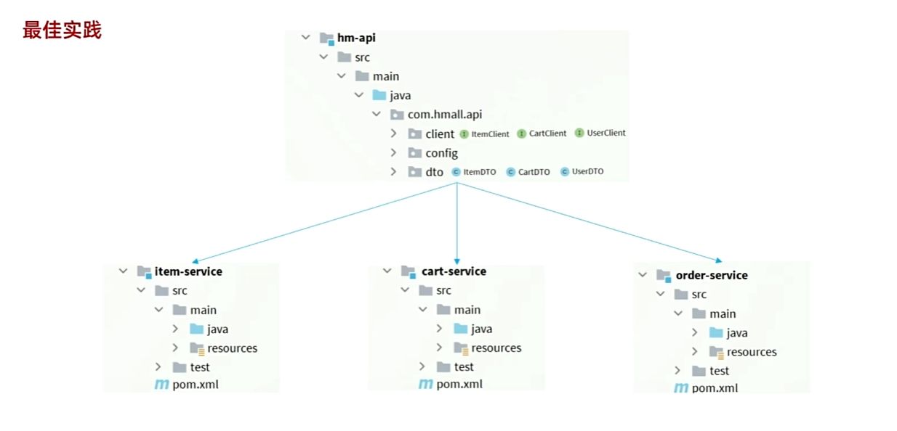
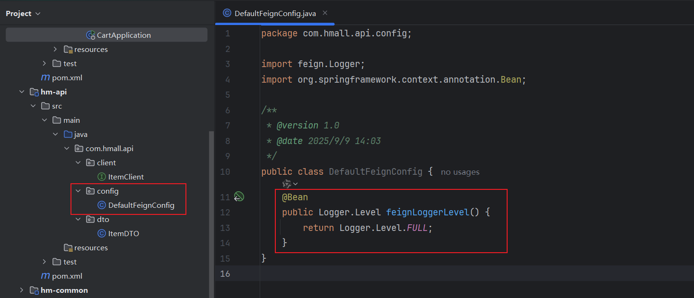

## 一、认识微服务

```PowerShell
# 启动nginx
start nginx.exe
# 停止
nginx.exe -s stop
# 重新加载配置
nginx.exe -s reload
# 重启
nginx.exe -s restart
```

### 1、单体架构

#### 1.1、介绍


### 2、微服务

#### 2.1、介绍


### 3、SpringCloud

#### 3.1、介绍


## 二、微服务拆分

### 1、熟悉商城项目


### 2、服务拆分原则

#### 2.1、拆分时机


#### 2.2、如何拆分


### 3、拆分服务

#### 3.1、拆分结构：独立Project


#### 3.2、拆分结构：Maven聚合


### 4、服务调用

#### 4.1、案例


#### 4.2、远程调用


===问题：如何通过Java代码让一个服务向另一个服务发起请求查询数据呢？


#### 4.3、服务远程调用的问题

```
服务治理问题
1.服务的调用者根本不知道服务提供者的地址
2.即使知道服务提供者的地址，但不知道具体访问哪一个
3.即使连接到一个地址，但突然挂了，怎么办？如果正在连接着一个地址，又突然生成多个地址，那么又如何感知新地址呢？
```


#### 4.4、注册中心原理


#### 4.5、Nacos注册中心

##### 4.5.1、介绍


##### 4.5.1、步骤-创建Nacos相关的表

===Nacos本身有数据需要存储，所以需要先去数据库中创建表

##### 4.5.2、将资源载入Linux中


##### 4.5.3、加载镜像


##### 4.5.4、创建并运行容器

```shell
docker run -d \
--name nacos \
--env-file ./nacos/custom.env \
-p 8848:8848 \
-p 9848:9848 \
-p 9849:9849 \
--restart=always \
nacos/nacos-server:v2.1.0-slim
```

===访问端口8848

```
192.168.100.128:8848/nacos
```


#### 4.6、服务注册


===配置完，启动项目即可


#### 4.7、服务发现


===不管服务是否停止还是重新启动，nacos都会感知到。

===扩展-开启多个服务实例


### 5、OpenFeign

=== 为什么要学习OpenFeign？

===服务的查询、负载均衡获取实例，以及http请求获取响应需要写很多代码。造成代码繁琐，不易维护。


#### 5.1、快速入门

##### 5.1.1、介绍


##### 5.1.2、原代码解析


##### 5.1.3、步骤


===补充：早期的负载均衡器是SpringCloud中的Ribbon，现在使用的是loadbalancer。


===基于SpringMVC的注解，来标记请求方式、请求路径、请求路径、返回值类型和服务名称。

##### 5.1.4、演示

```XML
  <!--openFeign-->
  <dependency>
      <groupId>org.springframework.cloud</groupId>
      <artifactId>spring-cloud-starter-openfeign</artifactId>
  </dependency>
  <!--负载均衡器-->
  <dependency>
      <groupId>org.springframework.cloud</groupId>
      <artifactId>spring-cloud-starter-loadbalancer</artifactId>
  </dependency>
```


#### 5.2、连接池

##### 5.2.1、介绍


===如果不使用连接池，会占用系统资源，影响程序的运行效率。

##### 5.2.2、步骤


```XML
<!--OK http 的依赖 -->
<dependency>
  <groupId>io.github.openfeign</groupId>
  <artifactId>feign-okhttp</artifactId>
</dependency>
```


#### 5.3、最佳实践

##### 5.3.1、优化

===如果item被多个类查询，每一个类都要编写相同的OpenFeign代码，编写重复性的代码、不利于代码维护。

##### 5.3.2、方式一


===弊端：项目结构更加复杂

##### 5.3.3、方式二



===弊端：耦合度更高了

##### 5.3.4、演示


===导入完成后，删除cart-service模块下重复的代码，并在serviceimpl下重新导包


```
Parameter 0 of constructor in com.hmall.cart.service.impl.CartServiceImpl required a bean of type 'com.hmall.api.client.ItemClient' that could not be found.
```

===原因：


===解决


#### 5.4、日志

##### 5.4.1、介绍


##### 5.4.2、修改日志级别的方法


##### 5.4.3、演示



===想要查看日志信息时，在启动类的@EnableFeignClients注解中添加属性。