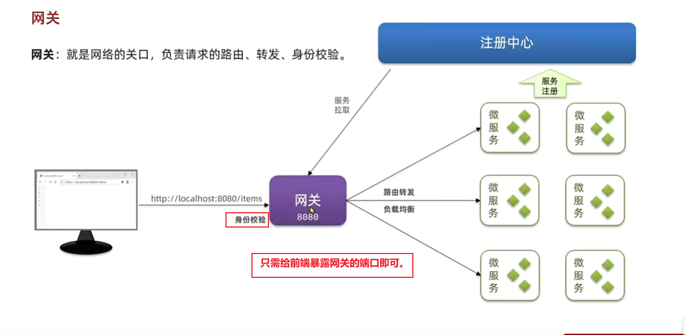
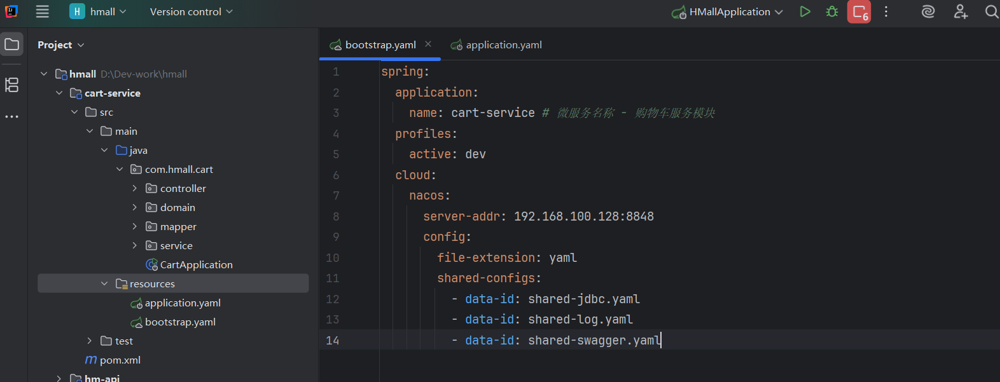
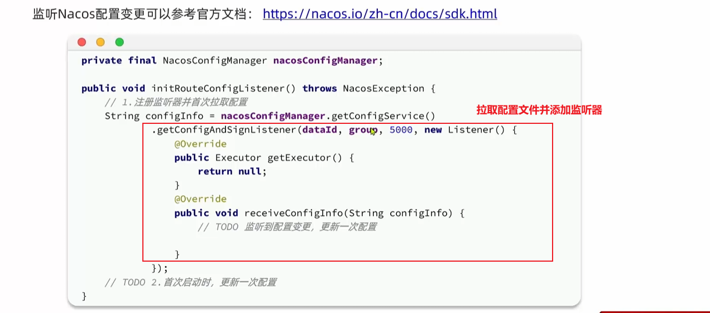

## 一、网关

### 1、问题解析

===原本前端只需根据一个端口号，就可以访问所有的页面，但是现在将所有的服务进行了拆分，每个服务都有一个端口，那么前端如何确定具体访问哪个端口呢？


### 2、介绍





### 3、网关种类


### 4、网关路由

#### 4.1、快速入门 

##### 4.1.1、分析


##### 4.1.2、步骤


（1）创建模块


（2）引入依赖

```xml
<!--common-->
<dependency>
    <groupId>com.heima</groupId>
    <artifactId>hm-common</artifactId>
    <version>1.0.0</version>
</dependency>
<!--网关-->
<dependency>
    <groupId>org.springframework.cloud</groupId>
    <artifactId>spring-cloud-starter-gateway</artifactId>
</dependency>
<!--nacos discovery-->
<dependency>
    <groupId>com.alibaba.cloud</groupId>
    <artifactId>spring-cloud-starter-alibaba-nacos-discovery</artifactId>
</dependency>
<!--负载均衡-->
<dependency>
    <groupId>org.springframework.cloud</groupId>
    <artifactId>spring-cloud-starter-loadbalancer</artifactId>
</dependency>
```

（3）启动类


（4）配置文件


#### 4.2、路由属性

##### 4.2.1、属性


##### 4.2.2、路由断言


##### 4.2.3、路由过滤器


===演示


===问题：如果每个服务都配过滤器，有没有简便的方法？


### 5、网关登录校验功能

##### 5.1、登录校验思路分析

（1）问题一


（2）问题二


（3）问题三

​		有一些复杂的业务还会出现微服务之间相互调用的情况，如：交易完成后清空购物车，那么trade-service就会调用cart-service，那么微服务之间如何转递用户信息？


#### 5.2、自定义过滤器

##### 5.2.1、种类


##### 5.2.2、演示


===扩展


===只要自定义的过滤器优先级高于NettyRoutingFilter过滤器的优先级即可


#### 5.3、实现登录校验

##### 5.3.1、案例


##### 5.3.2、演示


===补充：AntPathMatcher专门用于匹配带通配符和'/**'之类的路径


#### 5.4、网关转递用户

##### 5.4.1、思路


##### 5.4.2、步骤一


##### 5.4.3、步骤二


##### 5.4.4、演示


===配置拦截器


===配置类要想生效，需要被Spring扫描到，此时无法被扫描到

===Spring自动装配


```
===原因：网关模块hm-gateway的依赖也引入了hm-common，所以网关中也有拦截器的配置类。而WebMvcConfiguration是SpringMVC下的，网关的底层并不是基于SpringMVC，是一种响应式的、非阻塞式的编程，基于的是WebFlux。
```


#### 5.5、OpenFeign传递用户

##### 5.5.1、分析


##### 5.5.2、思路


##### 5.5.3、演示


##### 5.5.4、总结


### 6、配置管理

#### 6.1、介绍


#### 6.2、配置共享

##### 6.2.1、步骤一


##### 6.2.2、演示

```
localhost:8848/nacos
```


##### 6.2.3、步骤二


##### 6.2.4、演示

```XML
  <!--nacos配置管理-->
  <dependency>
      <groupId>com.alibaba.cloud</groupId>
      <artifactId>spring-cloud-starter-alibaba-nacos-config</artifactId>
  </dependency>
  <!--读取bootstrap文件-->
  <dependency>
      <groupId>org.springframework.cloud</groupId>
      <artifactId>spring-cloud-starter-bootstrap</artifactId>
  </dependency>
```




#### 6.3、配置热更新

##### 6.3.1、介绍


##### 6.3.2、案例


===此时购物车的数量超过2


#### 6.4、动态路由

##### 6.4.1、分析


##### 6.4.2、步骤一



```
===getConfigAndSignListener: 先拉取配置文件并加载一次，然后再添加监听器；
为什么要先加载配置文件？
	如果不先加载一次配置文件，那么监听器监听的路由表中没有数据，那么监听器就白配置了。
```

##### 6.4.3、演示

===网关模块中添加相应的依赖


##### 6.4.4、步骤二-更新路由表


##### 6.4.5、演示


===更新路由表之前需要删除旧的路由表


==================


```JSON
[
    {
        "id": "item",
        "predicates": [{
            "name": "Path",
            "args": {"_genkey_0":"/items/**", "_genkey_1":"/search/**"}
        }],
        "filters": [],
        "uri": "lb://item-service"
    },
    {
        "id": "cart",
        "predicates": [{
            "name": "Path",
            "args": {"_genkey_0":"/carts/**"}
        }],
        "filters": [],
        "uri": "lb://cart-service"
    },
    {
        "id": "user",
        "predicates": [{
            "name": "Path",
            "args": {"_genkey_0":"/users/**", "_genkey_1":"/addresses/**"}
        }],
        "filters": [],
        "uri": "lb://user-service"
    },
    {
        "id": "trade",
        "predicates": [{
            "name": "Path",
            "args": {"_genkey_0":"/orders/**"}
        }],
        "filters": [],
        "uri": "lb://trade-service"
    },
    {
        "id": "pay",
        "predicates": [{
            "name": "Path",
            "args": {"_genkey_0":"/pay-orders/**"}
        }],
        "filters": [],
        "uri": "lb://pay-service"
    }
]
```


===发布之后

