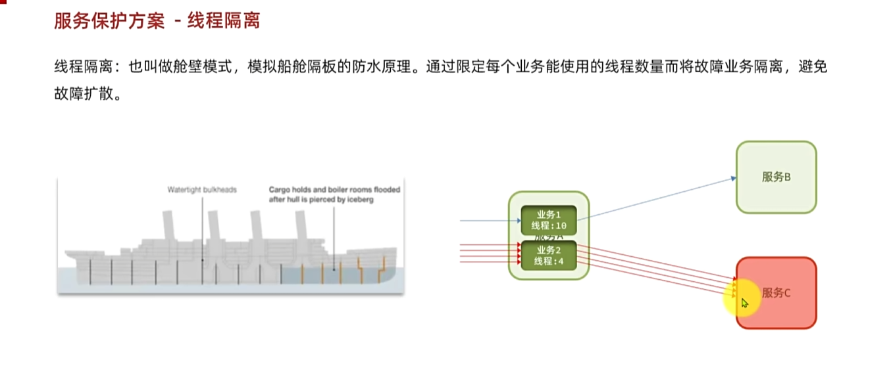
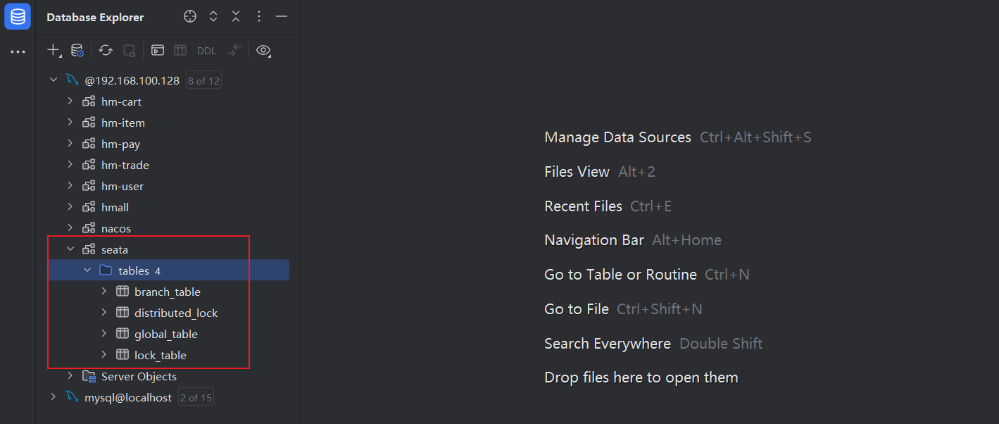

## 一、服务保护和分布式事务

### 1、前情回顾


## 二、雪崩问题

### 1、分析


### 2、小结


### 3、解决方案

#### 3.1、方案一-请求限流


#### 3.2、方案二-线程隔离



#### 3.3、方案三-服务熔断


#### 3.4、小结


#### 3.5、服务保护技术


### 4、Sentinel

#### 4.1、初始Sentinel

##### 4.1.1、介绍


##### 4.1.2、步骤

（1）下载jar包

（2）配置语句并执行

===因为Sentinel默认端口占用8080，与Tomacat服务器冲突了，需要改变端口

```Shell
java -Dserver.port=8090 -Dcsp.sentinel.dashboard.server=localhost:8090 -Dproject.name=sentinel-dashboard -jar sentinel-dashboard.jar
```


===账号和密码都是sentinel

（3）引入依赖

```XML
<!--sentinel-->
<dependency>
    <groupId>com.alibaba.cloud</groupId> 
    <artifactId>spring-cloud-starter-alibaba-sentinel</artifactId>
</dependency>
```

（4）配置文件

application.

```YAML
spring:
  cloud: 
    sentinel:
      transport:
        dashboard: localhost:8090
```

##### 4.1.3、演示


##### 4.1.4、簇点链路


##### 4.1.5、问题

​		问题：由于我们使用的是RESTful风格，因此像添加、更新的请求路径名称和簇点名称一致，导致无法具体监听


===解决：


#### 4.2、请求限流

##### 4.2.1、分析


##### 4.2.2、演示


符合预期结果


#### 4.3、线程隔离

##### 4.3.1、介绍


##### 4.3.2、分析


##### 4.3.3、演示


===没有开启线程隔离：此时已耗尽tomcat服务器的所有资源，导致无法再访问其它接口。


===开启线程隔离


此时就不会耗尽tomcat服务器的资源，可以正常访问其他接口，如删减数量。


#### 4.4、Fallback

##### 4.4.1、分析


##### 4.4.2、案例


##### 4.4.3、步骤


##### 4.4.4、演示


##### 4.4.5、总结

```
fallback的好处：即使服务查询失败，不会抛出异常，而是给出友好提示。
```


#### 4.5、服务熔断

##### 4.5.1、介绍


##### 4.5.2、原理


##### 4.5.3、分析


##### 4.5.4、演示


### 5、分布式事务

#### 5.1、介绍


#### 5.2、概念

​		在分布式系统中，如果一个业务需要多个服务合作完成，而且每个服务都有事务，多个事务必须同时成功或失败，这样的事务就是**分布式事务**。其中的每个服务的事务就是一个**分支事务**。整个业务称为**全局事务**。


#### 5.3、初始Seata

##### 5.3.1、介绍


##### 5.3.2、分布式事务解决思路


##### 5.3.3、Seata架构


#### 5.4、部署TC服务

##### 5.4.1、准备数据库表

Seata支持多种存储模式，但考虑到持久化的需要，我们一般选择基于数据库存储。执行课前资料提供的`《seata-tc.sql》`，导入数据库表



##### 5.4.2、准备配置文件


##### 5.4.3、Docker部署


```shell
docker load -i seata-1.5.1.tar # 加载镜像

docker network ls # 查看所有网络
docker inspect mysql # 查看mysql是否在hm-net网络里
docker inspect nacos # 查看nacos是否在hm-net网络里
docker network connect hm-net nacos # 如果nacos不在hm-net网络里，则加入该网络
```

然后在创建并运行容器seata

```Shell
docker run --name seata \
-p 8099:8099 \ # 微服务连接时使用的端口
-p 7099:7099 \ # 外部控制台访问的端口
-e SEATA_IP=192.168.100.128 \
-v ./seata:/seata-server/resources \
--privileged=true \
--network hm-net \
-d \
seataio/seata-server:1.5.2
```


```
192.168.100.128:7099
username: admin
password: admin
```


#### 5.5、微服务集成Seata

##### 5.5.1、步骤

在cart、item、trade服务中引入

```XML
<!--统一配置管理-->
  <dependency>
      <groupId>com.alibaba.cloud</groupId>
      <artifactId>spring-cloud-starter-alibaba-nacos-config</artifactId>
  </dependency>
  <!--读取bootstrap文件-->
  <dependency>
      <groupId>org.springframework.cloud</groupId>
      <artifactId>spring-cloud-starter-bootstrap</artifactId>
  </dependency>
  <!--seata-->
  <dependency>
      <groupId>com.alibaba.cloud</groupId>
      <artifactId>spring-cloud-starter-alibaba-seata</artifactId>
  </dependency>
```


（2）配置


```YAML
seata:
  registry: # TC服务注册中心的配置，微服务根据这些信息去注册中心获取tc服务地址
    type: nacos # 注册中心类型 nacos
    nacos:
      server-addr: 192.168.100.128:8848 # nacos地址
      namespace: "" # namespace，默认为空
      group: DEFAULT_GROUP # 分组，默认是DEFAULT_GROUP
      application: seata-server # seata服务名称
      username: nacos
      password: nacos
  tx-service-group: hmall # 事务组名称
  service:
    vgroup-mapping: # 事务组与tc集群的映射关系
      hmall: "default"
```


#### 5.6、XZ模式

##### 5.6.1、原理


```
耗时、性能差。不推荐
```

##### 5.6.2、小结


##### 5.6.3、实现步骤


（1）修改nacos的配置

```YAML
seata:
  data-source-proxy-mode: XA
```


（2）


##### 5.6.4、演示

即选择商品进入购物车，点击结算生成订单，此时再去修改数据库中选择商品的库存为0


点击结算后，进行了回滚


#### 5.7、AT模式

##### 5.7.1、介绍


##### 5.7.2、小结


##### 5.7.3、实现步骤


##### 5.7.4、演示

创建undo_log数据库表


