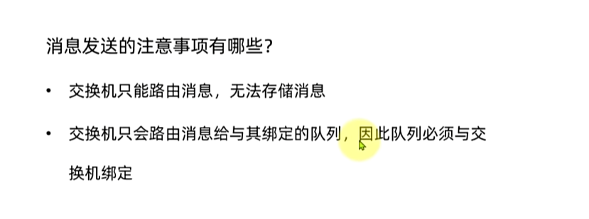
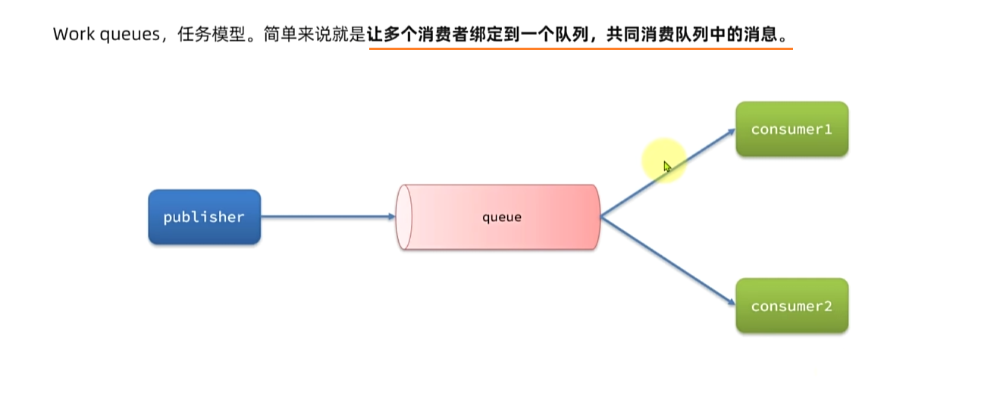
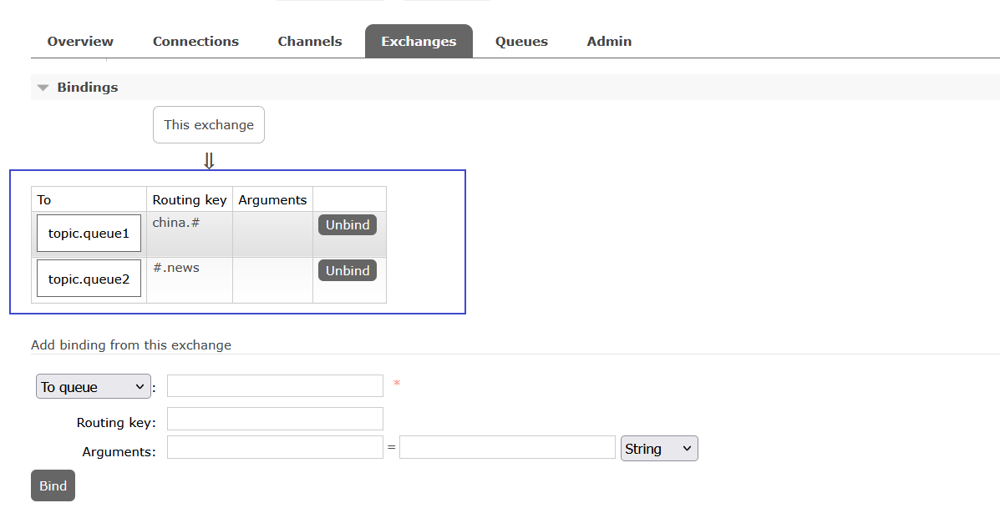

### RabbitMQ-高性能的异步通信组件

### 1、同步和异步的区别


### 2、初始MQ

#### 2.1、同步调用

##### 2.1.1、分析


##### 2.1.2、小结


#### 2.2、异步调用

##### 2.2.1、介绍


##### 2.2.2、分析


##### 2.2.3、小结


#### 2.3、MQ技术选型


### 3、RabbitMQ

#### 3.1、安装部署

##### 3.1.1、步骤

```shell
# 加载tar包
docekr load -i mq.tar
```

```Shell
docker run \
 -e RABBITMQ_DEFAULT_USER=mq \
 -e RABBITMQ_DEFAULT_PASS=123 \
 -v mq-plugins:/plugins \
 --name mq \
 --hostname mq \
 -p 15672:15672 \
 -p 5672:5672 \
 --network hm-net\
 -d \
 rabbitmq:3.8-management
```


##### 3.1.2、RabbitMQ基本介绍


#### 3.2、快速入门

##### 3.2.1、案例


##### 3.2.2、步骤


===为什么消息没有发送成功呢？

===交换机和队列没有建立联系。


##### 3.2.3、小结




#### 3.3、数据隔离

##### 3.3.1、案例


##### 3.3.2、演示


===登录新用户去调取mq用户的消息


### 4、Java客户端

#### 4.1、快速入门

##### 4.1.1介绍


##### 4.1.2、案例


##### 4.1.3、步骤


##### 4.1.4、演示

===配置文件

```YAML
spring:
  rabbitmq:
    host: 192.168.100.128 # 你的虚拟机IP
    port: 5672 # 端口
    virtual-host: /hmall # 虚拟主机
    username: hmall # 用户名
    password: 123 # 密码
```


##### 4.1.5、小结


#### 4.2、WorkQueues

##### 4.2.1、介绍



##### 4.2.2、案例


##### 4.2.3、演示


```
===workqueue的优点
队列中的消息只会被消费者使用一次；
一个队列绑定了两个消费者，采用了类似轮询的机制；
当发送的消息过多时，就可以使用workqueues任务模型来增加消费者，减轻压力，提升性能；
```

##### 4.2.4、新增需求


##### 4.2.5、消费者消息推送限制


##### 4.2.6、小结


#### 4.3、Fanout交换机

##### 4.3.1、介绍


特点：Fanout Exchange 会将接收到的消息路由到每一个跟其绑定的queue，所以也叫**广播模式**

##### 4.3.2、案例


交换机和队列进行绑定


##### 4.3.3、演示


##### 4.3.4、小结


#### 4.4、Direct交换机

##### 4.4.1、介绍


##### 4.4.2、案例


##### 4.4.3、演示

交换机和队列进行绑定


##### 4.4.4、小结


#### 4.5、Topic交换机

##### 4.5.1、介绍


##### 4.5.2、案例


##### 4.5.3、演示




##### 4.5.4、小结


#### 4.6、声明队列交换机

```
	上文提到的声明队列交换机的方式，在大型项目时不适用，手敲容易出错，因此，使用Java代码来声明队列和交换机。
```

##### 4.6.1、介绍


##### 4.6.2、基于Bean声明

```
队列和交换机可以通过new或xxxBuilder的方式声明；
而队列和交换机的绑定只能通过xxxBuilder的方式声明。
```


##### 4.6.3、演示


##### 4.6.4、基于注解声明

```
对于Direct交换机来说，基于Bean的声明太过繁琐，每有一个BindingKey就需要写一个方法。
```


##### 4.6.5、演示


#### 4.7、消息转换器

##### 4.7.1、案例


##### 4.7.2、演示


```
因此，不推荐使用JDK自带的转换器。
```


##### 4.7.3、推荐转换器


##### 4.7.4、演示

```xml
<!--jackson-->
<dependency>
    <groupId>com.fasterxml.jackson.core</groupId>
    <artifactId>jackson-databind</artifactId>
</dependency>
```


启动测试类


#### 4.8、业务改造


trade、和pay服务都需要引入amqp的依赖

```xml
<!--amqp-->
<dependency>
    <groupId>org.springframework.boot</groupId>
    <artifactId>spring-boot-starter-amqp</artifactId>
</dependency>
```

添加配置信息

```yaml
spring:
  rabbitmq:
    host: 192.168.100.128 # 你的虚拟机IP
    port: 5672 # 端口
    virtual-host: /hmall # 虚拟主机
    username: hmall # 用户名
    password: 123 # 密码
```

消息的发送者和接收者都需要消息转换器，所以在common中编写配置类


