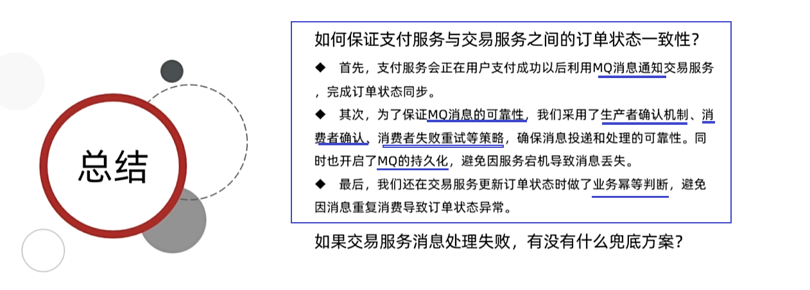

### 消息可靠性问题


## 一、发送者的可靠性

### 1、发送者重连

#### 1.1、介绍


### 2、发送者确认

#### 2.1、介绍


#### 2.2、SpringAMQP实现发送者确认


#### 2.3、演示


```
由于开启消息确认，会影响系统性能，一般建议不开启；除非有特殊场景必须使用
```


## 二、MQ的可靠性

### 1.、分析


### 2、数据持久化

#### 2.1、分析


#### 2.2、演示


### 3、Lazy Queue

#### 3.1、介绍


#### 3.2、配置LazyQueue

##### 3.2.1、控制台


##### 3.2.2、代码实现


##### 3.2.3、演示


### 4、比较


```
根据两种方式的吞吐量来说，一般选择LazyQueue方式，不管是持久化还是非持久化的数据都会写到磁盘。速度快、性能强、并发能力好。
```

### 5、总结&面试题


## 三、消费者的可靠性

### 1、消费者确认机制

#### 1.1、介绍


#### 1.2、配置


#### 1.3、演示


```
如果收到消息后，队列会处于uack状态(未确认状态)，直到消费者返回ack，队列才会删除消息；
如果收到消息后，业务逻辑抛出消息转换异常，MQ会自动帮消费者返回reject，队列直接删除消息。
```


### 2、失败重试机制

#### 2.1、介绍&配置


#### 2.2、演示


#### 2.3、失败消息处理策略


#### 2.4、配置


#### 2.5、演示


#### 2.6、小结


### 3、业务幂等性

#### 3.1、介绍


#### 3.2、唯一ID


===弊端

```
对原代码有浸入，在原业务的基础上每次获取消息时都要去数据库查找消息ID，并进行健壮性判断。不推荐该方案。
```


#### 3.3、业务判断


#### 3.4、总结 & 面试题




## 四、延迟消息

```
因为谁也无法保证网络没有问题，因此还需要一些兜底方案
```

### 1、介绍


### 2、死信交换机

#### 2.1、介绍


#### 2.2、演示


### 3、延迟消息插件

#### 3.1、介绍


#### 3.2、演示

下载插件


导入容器中


安装插件

```shell
docker exec -it mq rabbitmq-plugins enable rabbitmq_delayed_message_exchange
```


```
注意：消息的延迟依赖CPU的支持，因此要避免同一时刻大量数据进行延迟，给CPU造成影响。
```


### 4、取消超时订单

#### 4.1、分析


#### 4.2、演示


