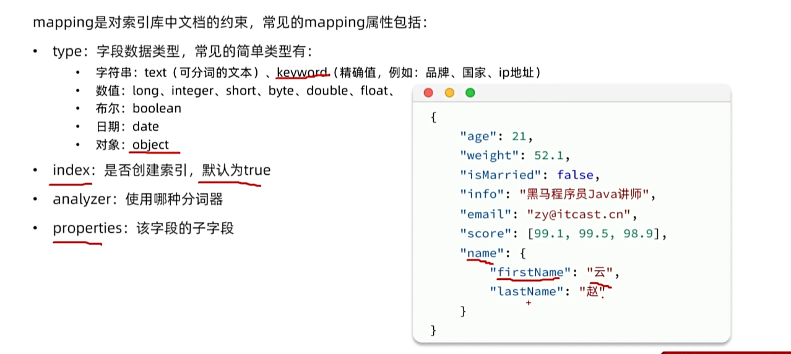

### Elasticsearch高性能分布式搜索引擎

## 一、引言

### 1、普通搜索和使用Elasticsearch的对比

```
该搜索功能是对数据库进行模糊查询，一旦数据库中的数据过多，那么查询所需的时间会更久。
```


### 2、为什么要选择Elasticsearch搜索引擎？


## 二、初识Elasticsearch

### 1、认识和安装

#### 1.1、介绍


#### 1.2、安装

将安装包拖入Linux系统并加载，然后删除tar包

```Bash
docker run -d \
  --name es \
  -e "ES_JAVA_OPTS=-Xms512m -Xmx512m" \
  -e "discovery.type=single-node" \
  -v es-data:/usr/share/elasticsearch/data \
  -v es-plugins:/usr/share/elasticsearch/plugins \
  --privileged \
  --network hm-net \
  -p 9200:9200 \
  -p 9300:9300 \
  elasticsearch:7.12.1
```


```Bash
docker run -d \
--name kibana \
-e ELASTICSEARCH_HOSTS=http://es:9200 \
--network=hm-net \
-p 5601:5601  \
kibana:7.12.1
```


### 2、倒排索引

#### 2.1、介绍


#### 2.2、小结


### 3、IK分词器

#### 3.1、介绍 & 操作


#### 3.2、演示


#### 3.3、扩展词典


#### 3.4、小结


### 4、基础概念

#### 4.1、介绍


#### 4.2、MySQL与Elasticsearch的比较


### 5、索引库操作

#### 5.1、Mapping映射属性

```
相当于MySQL数据库里对字段的约束。
```




```
info字段需要分词；而邮箱分词没有意义，因此选择keyword。
```


#### 5.2、索引库操作语法

```
Elaticsearch 支持Restful风格
增: put
删: delete
改: post
查: get
```

##### 5.2.1、新增


##### 5.2.2、查询和删除


##### 5.2.3、更新


```json
# 创建索引库并设置mapping映射
PUT /users
{
  "mappings": {
    "properties": {
      "info": {
        "type": "text",
        "analyzer": "ik_smart"
      },
      "email": {
        "type": "keyword",
        "index": false
      },
      "name": {
        "type": "object",
        "properties": {
          "firstName": {
            "type": "keyword"
          },
          "lastName": {
            "type": "keyword"
          }
        }
      }
    }
  }
}

# 查询索引库
GET /users

# 删除索引库
DELETE /users

# 更新索引库
POST /users/_mapping
{
  "properties": {
    "age": {
      "type": "byte"
    }
  }
}
```


##### 5.2.4、小结


### 6、文档操作

#### 6.1、文档CRUD

##### 6.1.1、新增文档


##### 6.1.2、查询&删除


##### 6.1.3、增量/局部 修改文档


```json
# 新增文档
POST /users/_doc/1
{
  "info": "黑马程序员Java讲师",
  "email": "zy@itcast.cn",
  "name": {
    "firstName": "云",
    "lastName": "赵"
  }
}

# 查询文档
GET /users/_doc/1

# 删除文档
DELETE /users/_doc/1

# 全量修改
PUT /users/_doc/1
{
  "info": "黑马程序员Java讲师",
  "email": "ZY@itcast.cn",
  "name": {
    "firstName": "云",
    "lastName": "赵"
  }
}

# 增量/局部 修改
POST /users/_update/1
{
  "doc": {
    "email": "ZhaoYun@itcast.cn"
  }
}
```


##### 6.1.4、小结


#### 6.2、批量处理


### 7、JavaRestClient


#### 7.1、客户端初始化


```java
class ElasticTest {
    private RestHighLevelClient client;

    @Test
    void testConnection() {
        System.out.println("client = " + client);
    }

    @BeforeEach
    void setUp() { // 创建
        client = new RestHighLevelClient(
                RestClient.builder(HttpHost.create("192.168.100.128:9200")));
    }

    @AfterEach
    void tearDown() throws IOException { // 销毁
        if (client != null) {
            client.close();
        }
    }
}
```


#### 7.2、商品表Mapping映射


#### 7.3、索引库操作

##### 7.3.1、新增


##### 7.3.2、删除&查询


##### 7.3.3、小结


#### 7.4、文档操作

##### 7.4.1、新增文档


##### 7.4.2、删除文档


##### 7.4.3、查询文档


##### 7.4.4、修改文档


##### 7.4.5、小结


#### 7.5、批处理

##### 7.5.1、介绍


##### 7.5.2、批量新增


```java
/*批处理*/
@Test
void testBulkDocument() throws IOException {
    // 1. 分页查询数据库中的数据
    int pageNo = 1, pageNum = 500;
    while (true) {
        // 2. 根据条件分页
        Page<Item> page = itemService.lambdaQuery()
                .eq(Item::getStatus, 1)
                .page(Page.of(pageNo, pageNum));

        // 3. 得到查询后的结果集
        List<Item> records = page.getRecords();
        if (records == null || records.isEmpty()) {
            return;
        }

        // 4. 创建请求
        BulkRequest request = new BulkRequest();
        // 5. 批量新增
        for (Item item : records) {
            request.add(new IndexRequest("items").id(StrUtil.toString(item.getId()))
                    .source(JSONUtil.toJsonStr(BeanUtil.copyProperties(item, ItemDoc.class)), XContentType.JSON));
        }
        // 6. 发起请求
        client.bulk(request, RequestOptions.DEFAULT);
        // 7. 翻页
        pageNo++;
    }
}
```


